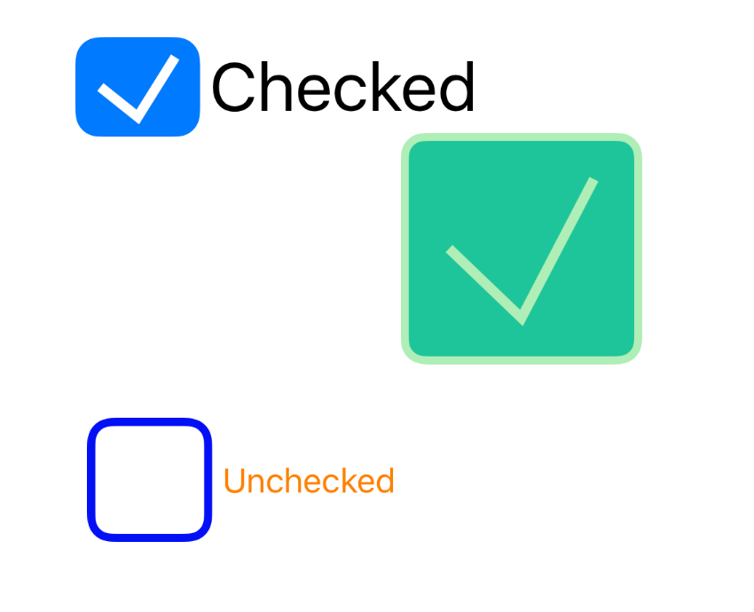

# iOS
CheckboxKit
=====================

This sample shows how to create a dynamic embedded iOS framework using a custom checkbox control in Objective C.   More information about the framework is available here: http://www.goxuni.com/671475-how-to-create-an-ios-framework-for-a-custom-control/ and more information about the control is available here: http://www.goxuni.com/671282-creating-a-custom-ios-checkbox-control-in-objective-c/ ‎

